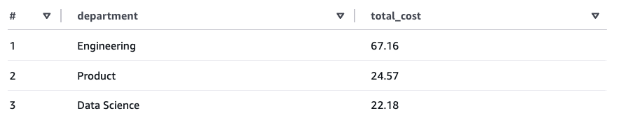

# Cost Attribution for Amazon Bedrock

This applies to the **direct IAM path** (`FederationType=direct`) only. The Cognito path handles cost attribution automatically.

---

## 1. Built-in per-user tracking (no IdP changes required)

The credential provider embeds the user's email in the STS session name, so the resulting principal ARN looks like:

```
arn:aws:sts::123456789012:assumed-role/app-role/alice@acme.com
```

This ARN automatically appears in the `line_item_iam_principal` column of CUR 2.0 when IAM principal data is enabled. **This is the default behavior — no IdP changes or tag configuration required.**

### Enable IAM principal data in CUR 2.0

1. Open the Billing and Cost Management console → **Data Exports**
2. Create or edit a Standard data export (CUR 2.0)
3. Under **Additional export content**, enable **"Include caller identity (IAM principal) allocation data"**

The following example shows per-user Bedrock costs queried from CUR 2.0 data using Athena:


Each user's email is visible in the `line_item_iam_principal` column, enabling per-user cost visibility without any IdP changes or tag configuration.

> **Note:** `line_item_iam_principal` is available in CUR 2.0 data and can be queried using tools like Athena or QuickSight. Cost Explorer does not expose this column as a filter or grouping dimension. To see per-user costs in Cost Explorer, configure session tags as described in [section 3](#3-optional-session-tags-for-richer-per-user-attribution).

---

## 2. IAM principal tags for team/department-level attribution

Tags applied to IAM principals (users or roles) in the IAM console appear in CUR 2.0 with the `iamPrincipal/` prefix (e.g., `iamPrincipal/department`, `iamPrincipal/cost-center`). In this solution all federated users share the same role, so role-level tags are useful for team or department attribution but cannot distinguish between individual users.

To set this up:

1. In the IAM console, tag the federation role with organizational tags (e.g., `department`, `cost-center`)
2. In the Billing and Cost Management console → **Cost Allocation Tags**, filter for **IAM principal type** tags, select the desired tags, and click **Activate**
3. Tags only appear after the role has made at least one Bedrock API call, and take up to **24 hours to appear** and a further **24 hours to activate**

---

## 3. Optional: session tags for richer per-user attribution

If you need per-user **tag-based** cost allocation (beyond the session name in the ARN), you can embed session tags in the ID token.

When `AssumeRoleWithWebIdentity` is called, STS reads the `https://aws.amazon.com/tags` claim from the ID token and attaches those tags to the resulting session. Once activated as **user-defined cost allocation tags** (not the "IAM principal type" filter), they appear in CUR 2.0 and Cost Explorer.

### Trust policy requirement

The IAM role's trust policy must include `sts:TagSession` in addition to `sts:AssumeRoleWithWebIdentity`. Without it, the `AssumeRoleWithWebIdentity` call fails entirely with an `AccessDenied` error — STS does not silently ignore the tags.

### Claim format

Your IdP must add the `https://aws.amazon.com/tags` claim to the ID token. Two formats are accepted by STS:

- **Nested object** (Auth0): tag values are single-element arrays inside a `principal_tags` object.
- **Flattened per-key claims** (Okta, Entra ID): one claim per tag, with plain string values and JSON Pointer-encoded paths.

Nested object format (Auth0):

```json
{
  "principal_tags": {
    "UserEmail": ["alice@acme.com"],
    "UserId":    ["user-internal-id"]
  },
  "transitive_tag_keys": ["UserEmail", "UserId"]
}
```

### Auth0

Add a post-login Action that sets the claim:

```javascript
exports.onExecutePostLogin = async (event, api) => {
  api.idToken.setCustomClaim('https://aws.amazon.com/tags', {
    principal_tags: {
      UserEmail: [event.user.email],
      UserId:    [event.user.user_id],
    },
    transitive_tag_keys: ['UserEmail', 'UserId'],
  });
};
```

### Okta

Okta's Expression Language cannot produce a JSON object value directly. Use an [Okta inline token hook](https://developer.okta.com/docs/guides/token-inline-hook/) with `com.okta.identity.patch` operations to inject the flattened per-key claim format. URI-style claim names must be JSON Pointer-encoded: `/` becomes `~1`, so `https://aws.amazon.com/tags` as a patch path becomes `https:~1~1aws.amazon.com~1tags`.

Your token hook endpoint must return:

```json
{
  "commands": [{
    "type": "com.okta.identity.patch",
    "value": [
      {
        "op": "add",
        "path": "/claims/https:~1~1aws.amazon.com~1tags~1principal_tags~1UserEmail",
        "value": "alice@acme.com"
      },
      {
        "op": "add",
        "path": "/claims/https:~1~1aws.amazon.com~1tags~1principal_tags~1UserId",
        "value": "user-internal-id"
      },
      {
        "op": "add",
        "path": "/claims/https:~1~1aws.amazon.com~1tags~1transitive_tag_keys",
        "value": ["UserEmail", "UserId"]
      }
    ]
  }]
}
```

> **Note:** AWS requires `transitive_tag_keys` to be an array of strings. Okta's hook schema formally types `value` as a scalar string, so array support depends on runtime behavior — test this against your Okta org. If Okta rejects the array, mark only the tag key you need in Cost Explorer (e.g., `"UserEmail"`) and accept that the other key will not propagate to child sessions.

Refer to the [token inline hook reference](https://developer.okta.com/docs/reference/token-hook/) for the full request/response schema.

### Microsoft Entra ID

Entra ID's custom claims provider does not support JSON object values (only `String` and `String array`), so use the [flattened STS claim format](https://docs.aws.amazon.com/IAM/latest/UserGuide/id_session-tags.html) via a [custom claims provider](https://learn.microsoft.com/en-us/entra/identity-platform/custom-claims-provider-overview) backed by an Azure Function. The function must return:

```json
{
  "data": {
    "@odata.type": "microsoft.graph.onTokenIssuanceStartResponseData",
    "actions": [
      {
        "@odata.type": "microsoft.graph.tokenIssuanceStart.provideClaimsForToken",
        "claims": {
          "https://aws.amazon.com/tags/principal_tags/UserEmail": "alice@acme.com",
          "https://aws.amazon.com/tags/principal_tags/UserId":    "object-id-from-entra",
          "https://aws.amazon.com/tags/transitive_tag_keys":      ["UserEmail", "UserId"]
        }
      }
    ]
  }
}
```

### Activate session tags as cost allocation tags

After at least one Bedrock API call has been made with session tags:

1. Open **Billing and Cost Management console → Cost Allocation Tags**
2. Filter for **user-defined** cost allocation tags (not "IAM principal type" — that is for section 2 role-level tags)
3. Locate `UserEmail` and `UserId` and click **Activate** — tags take up to **24 hours to appear** after the first tagged API call, and a further **24 hours to activate**
4. In Cost Explorer, group or filter by **Tag → `UserEmail`** to see per-user Bedrock spend

Once activated, session tags are available in both **Cost Explorer** and **CUR 2.0**. This means you can group or filter costs by tag in the Cost Explorer console without needing Athena, unlike the `line_item_iam_principal` column in section 1 which is only available in CUR 2.0.

With session tags configured, you can also group costs by department or any other tag dimension. The following example shows department-level Bedrock costs queried from CUR 2.0 data using Athena:



---

## 4. Per-project cost attribution driven by IdP groups

A common variant of section 3: the customer team creates one IdP group per project and adds developers to groups. They want monthly Bedrock spend rolled up by project in Cost Explorer, with **no AWS-side work whenever a new project starts** — just Okta group creation and user assignment.

This is section 3 applied to a single `Project` tag whose value comes from the user's IdP group membership. The filter that decides "which of this user's groups is the project" lives inside the IdP's expression engine — no code change needed in this tool.

### Recommended convention: group name = `<ccwb-profile-name>-<ProjectName>`

Reuse your ccwb profile name as the Okta group prefix. Example — if your ccwb profile is `acme-prod`:

| Your Okta group | What you see in AWS Cost Explorer |
| --- | --- |
| `acme-prod-Alpha`         | `iamPrincipal/Project = Alpha` |
| `acme-prod-Beta`          | `iamPrincipal/Project = Beta` |
| `acme-prod-WidgetProject` | `iamPrincipal/Project = WidgetProject` |

Benefits:
- **One pattern across all your deployments.** Different profiles (e.g. `acme-prod` vs. `acme-dev`) produce distinct Okta groups, so a single Okta tenant can back multiple ccwb deployments without clashing.
- **No per-project AWS work.** Adding a new project is one Okta-side action: create group + add users.
- **Profile name constraints are validated at `ccwb init`**: letters/digits/hyphens, starts with a letter, 2-63 chars. That set is a subset of what Okta and AWS tag values accept, so your chosen profile name is always a valid Okta prefix.
- `ccwb init` prints the exact Okta claim expression to paste when you're done. No hunting through this doc.

### Operator workflow

**One-time admin setup** (per ccwb deployment / per Okta tenant):
1. Configure the IdP Authorization Server to emit `https://aws.amazon.com/tags` with a `Project` claim value derived from the user's project group (recipes below).
2. After the first tagged Bedrock call reaches CUR 2.0 (~24h latency), activate `Project` as a **user-defined cost allocation tag** in the Billing console → Cost Allocation Tags.

**Per-new-project (customer team, every time):**
1. Create Okta group `<profile>-<ProjectName>` (e.g. `acme-prod-Gamma`).
2. Assign the group to your Claude Code OIDC applications.
3. Add developers to the group.
4. Done. No `ccwb deploy`, no new bundle, no CloudFormation change.

### Okta: Authorization Server claim expression (recommended path)

**Security → API → Authorization Servers → default → Claims → Add Claim**:

| Field | Value |
| --- | --- |
| Name | `https://aws.amazon.com/tags/principal_tags/Project` |
| Include in token type | **ID Token → Always** |
| Value type | **Expression** |
| Value | `String.substringAfter(Groups.startsWith("OKTA", "<profile>-", 10).get(0), "<profile>-")` |
| Disable claim if expression returns | **Empty string** (tick the box) |
| Include in | **The following scopes → `openid`** |

The expression:
1. `Groups.startsWith("OKTA", "<profile>-", 10)` — grab up to 10 Okta-source groups whose name starts with the profile prefix.
2. `.get(0)` — take the first one.
3. `String.substringAfter(..., "<profile>-")` — strip the prefix.

If the user is in no matching group, the expression result is empty and the "Disable claim if empty" option suppresses the whole claim (no stray tag).

`ccwb init` prints this exact expression — substituted with your actual profile name — when you finish the wizard.

### Alternative IdP recipes (same mechanism, different engines)

**Auth0 Post-Login Action** (`<profile>` substituted in the action code):

```javascript
exports.onExecutePostLogin = async (event, api) => {
  const prefix = 'acme-prod-';   // replace 'acme-prod' with your ccwb profile name
  const role = (event.authorization?.roles || [])
    .find(r => r.startsWith(prefix));
  if (role) {
    api.idToken.setCustomClaim('https://aws.amazon.com/tags', {
      principal_tags: { Project: [role.slice(prefix.length)] },
      transitive_tag_keys: ['Project']
    });
  }
};
```

**Microsoft Entra ID**: use a [custom claims provider](https://learn.microsoft.com/en-us/entra/identity-platform/custom-claims-provider-overview) backed by an Azure Function. The function queries the user's group memberships, filters to names starting with your profile prefix, strips the prefix, and returns a flattened tag claim: `"https://aws.amazon.com/tags/principal_tags/Project": "Alpha"`.

### Alternative conventions if the profile-name prefix doesn't fit

You may need a different Okta group shape when:

- **Existing group names you can't rename.** Okta is sourced from Workday / AD with fixed names like `Alpha Team`, `XYZ_Initiative`. Use **Pattern C** (below) — user profile attribute + Group Rules — which accepts any group name.
- **Multiple ccwb deployments sharing the same Okta tenant and the same project list.** One group should serve both deployments. Use the same **Pattern C** approach with a tenant-wide `user.claudeProject` attribute.
- **You want to opt individual groups in without renaming them.** Use **Pattern B** — custom group attribute — and toggle membership via an attribute flag.

#### Pattern C — User profile attribute maintained by Group Rules

Admin defines a user profile attribute `user.claudeProject` (Directory → Profile Editor → User (default) → Add Attribute). An Okta Group Rule maps "member of Group X" → `claudeProject = "X"`. The claim then emits `user.claudeProject` directly — the expression is simply `user.claudeProject`.

Per-new-project cost: one Group Rule per project group, plus the group itself. Any group name works.

#### Pattern B — Custom attribute on the Okta group object

Admin defines a custom attribute on the Okta group object (Directory → Profile Editor → Groups → Add Attribute, e.g. `claudeProject` as boolean). Mark project-bearing groups as `claudeProject=true`. Then use an Okta inline token hook that filters `context.session.identity.groups` on that attribute and emits the first match's name as the tag.

Pattern B requires an inline token hook (a hosted HTTPS endpoint) because Okta's declarative claim expression can't filter groups by a custom attribute. More flexible than A but more infrastructure.

### Which convention to pick

| Convention | Okta setup cost | Per-new-project effort | Group-name freedom |
| --- | --- | --- | --- |
| **Profile-name prefix** (recommended) | Low — one claim expression | Zero — just create group + assign users + assign to app | Must start with `<profile>-` |
| **Pattern C** — user profile attribute + Group Rules | Medium — one-time attribute, then one Group Rule per project | Medium — add a Group Rule every new project | Any name |
| **Pattern B** — custom group attribute + token hook | High — requires a hosted inline-hook endpoint | Low — toggle the attribute | Any name |

For the typical customer described in this section, **the profile-name prefix** is the minimum-friction choice. Agree on the prefix once at ccwb setup, and onboarding is Okta-only forever after.

### Verifying it works

Once the IdP is configured and a user has signed in at least once, run the diagnostic:

```bash
credential-process --profile <profile> --show-tags
```

This decodes the user's cached ID token and prints the `https://aws.amazon.com/tags` claim. Output should look like:

```json
{
  "principal_tags": {
    "Project": ["Alpha"]
  },
  "transitive_tag_keys": ["Project"]
}
```

If the claim is missing entirely, the IdP isn't emitting it — revisit the patterns above. If the value is wrong, the IdP expression is picking the wrong group.

### Multi-project users

If a developer is in more than one project group, patterns A–C will pick **one** deterministically (first app-assigned role, first tagged group, first matching Group Rule — depending on pattern). This is usually fine for attribution: spend rolls up to one project per session.

If developers legitimately split work across multiple projects within a single session, you have three options:

1. **Don't. Create one Okta user per project-developer pair.** Cleanest from an attribution standpoint.
2. **Use an explicit "primary project" attribute (Pattern C).** User's manager maintains `user.currentProject` in HR/Okta when people switch teams.
3. **Emit all of the user's project groups into one `Project` session tag as a comma-joined value** (`Project=Alpha,Beta`). Cost Explorer will treat that literal string as one tag value — meaning "Alpha,Beta" is a distinct project from "Alpha" or "Beta" alone. Rarely what you want.

None of these require changes to our Go binary, CloudFormation, or Python CLI — all live in IdP configuration.
